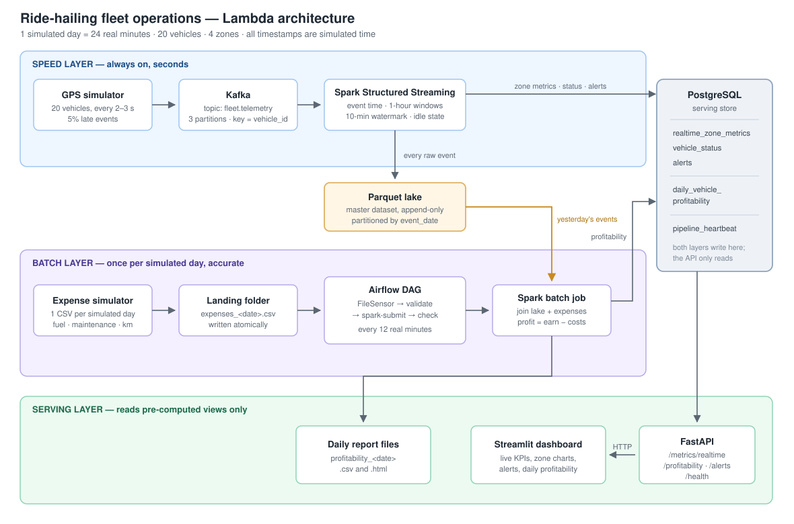

# Ride-Hailing Fleet Operations — Lambda Architecture Pipeline

EC8203 Applied Big Data Engineering — Mini Project, Use Case 1

A working end-to-end data pipeline that answers one operational question:

> **What is fleet utilization and earnings by area and time of day right now, and
> which vehicles are becoming unprofitable once yesterday's fuel and maintenance
> costs are factored in?**

The two halves of that question have different latency requirements, which is why
the system is built as a **Lambda architecture**: a speed layer answers "right now"
in seconds, and a batch layer answers "profitable?" once per day, accurately.

---

## 1. Architecture



**Kafka is only used by the speed layer.** The expense file is bounded daily data,
so it is ingested by a file drop that Airflow's FileSensor detects — pushing a
daily CSV through a stream would add complexity with no benefit.

---

## 2. Technology choices

| Concern | Choice | Why |
|---|---|---|
| Architecture | **Lambda** | The business question has two halves with different latency needs; the expense file is bounded daily data; the batch layer provides accurate historical reprocessing |
| Ingestion (stream) | **Kafka** (KRaft, 3 partitions, key = `vehicle_id`) | Keyed partitioning keeps each vehicle's events ordered; retention allows replay |
| Ingestion (batch) | **File drop + Airflow FileSensor** | Bounded data with a clear start and end |
| Processing | **Spark** for *both* layers | "Unified: Batch, Streaming, SQL, and ML" — one engine, one DataFrame API, shared zone logic. Directly mitigates Lambda's main weakness (maintaining two codebases) |
| Master dataset | **Parquet**, partitioned by `event_date` | Columnar (batch job reads 3 of 9 columns), compressed, schema embedded, partition pruning |
| Serving store | **PostgreSQL** | Pre-computed views only; simple, queryable, sufficient at this scale |
| Orchestration | **Airflow** (LocalExecutor) | Sensor-driven scheduling, retries, task-level logs, visible DAG state |
| API | **FastAPI** | Auto-generated OpenAPI docs, async server, minimal boilerplate |
| Dashboard | **Streamlit** | ~150 lines of Python for a live dashboard |

**Rejected alternatives:** Kappa (would force a daily CSV through a stream and
require stream replay for reconciliation); Storm (event-at-a-time latency not
needed — seconds suffice, and Spark gives one engine for both layers);
Cassandra (overkill for a 20-vehicle serving layer).

---

## 3. The simulated clock

A real day of data would take a real day to produce, so the whole system runs on a
compressed clock:

```
1 simulated day  = 24 real minutes
1 simulated hour = 1 real minute
1 real second    = 1 simulated minute        (compression factor 60)
```

Every component — both simulators, both Spark jobs, the Airflow DAG — reads the
same anchor from `data/.sim_epoch`, written by whichever process starts first.
Without this each process would start its own clock at simulated day 1, and a
component launched ten minutes later would be ten simulated hours behind,
silently joining the wrong days together.

All event timestamps, windows, watermarks and report dates are in **simulated
time**. Deleting `data/.sim_epoch` restarts the simulation from day 1.

---

## 4. Repository layout

```
project/
├── docker-compose.yaml          all 8 services
├── requirements.txt             host-side deps for the simulators
├── sql/
│   ├── 00_create_airflow_db.sql
│   └── 01_schema.sql            5 serving tables
├── common/                      shared by every component
│   ├── config.py                all tunable constants
│   ├── sim_clock.py             shared simulated clock
│   ├── zones.py                 lat/lon → zone (used by BOTH Spark layers)
│   └── logging_config.py        structured JSON logging
├── simulators/
│   ├── telemetry_producer.py    GPS events → Kafka
│   └── expense_generator.py     daily expense CSV → landing folder
├── streaming/
│   └── speed_layer.py           Spark Structured Streaming
├── batch/
│   └── profitability_job.py     Spark batch reconciliation
├── airflow/
│   ├── Dockerfile               Airflow + Java 17 + PySpark
│   └── dags/daily_reconciliation_dag.py
├── serving/
│   ├── Dockerfile               shared image for API + dashboard
│   ├── requirements.txt
│   ├── api/main.py              FastAPI
│   └── dashboard/app.py         Streamlit
└── data/                        created at runtime
    ├── .sim_epoch               shared clock anchor
    ├── lake/raw/telemetry/      Parquet master dataset
    ├── landing/                 expense CSVs
    └── reports/                 daily profitability reports
```

---

## 5. Prerequisites

- **Docker Desktop** (WSL2 backend on Windows), ~8 GB free RAM
- **Python 3.12** for the host-side simulators (3.13+ lacks wheels for some deps)
- ~4 GB disk for images

---

## 6. Running the pipeline

### First time

```powershell
# 1. Build the two custom images (Airflow ~500 MB, serving ~150 MB, one-time)
docker compose build

# 2. Start everything
docker compose up -d

# 3. Wait for Spark to download its jars (~3 min the first time)
docker compose logs -f spark-speed
#    wait for: [speed_layer] reading fleet.telemetry from kafka:9092

# 4. Host-side Python environment
py -3.12 -m venv .venv
.venv\Scripts\activate
pip install -r requirements.txt
```

### Every run

```powershell
# Terminal 1 — GPS telemetry (start this FIRST; it creates data/.sim_epoch)
.venv\Scripts\activate
python -m simulators.telemetry_producer

# Terminal 2 — daily expense files, watch mode
.venv\Scripts\activate
python -m simulators.expense_generator
```

Then open Airflow and **unpause** the `daily_reconciliation` DAG.

### What happens, unattended

| Real time | Event |
|---|---|
| ~15 s | `vehicle_status` populated, Parquet lake created |
| ~1 min | First completed 1-hour window per zone |
| ~2 min | First `LONG_IDLE` alerts |
| **24 min** | Simulated day ends → `expenses_<date>.csv` written |
| **≤ 36 min** | DAG's FileSensor finds it → validate → Spark → profitability + report |
| 48 min | Next day, automatically |

---

## 7. Interfaces

| UI | URL | Credentials |
|---|---|---|
| Live dashboard (Streamlit) | http://localhost:8501 | — |
| API docs (Swagger) | http://localhost:8000/docs | — |
| Airflow | http://localhost:8080 | `admin` / `admin` |
| Kafka UI | http://localhost:8085 | — |
| Spark UI (speed layer) | http://localhost:4040 | — |

### API endpoints

| Endpoint | Layer | Answers |
|---|---|---|
| `GET /metrics/realtime` | speed | Active vehicles, idle ratio, trips/hour, earnings by zone |
| `GET /metrics/zones?limit=96` | speed | Hourly windows — earnings by area and time of day |
| `GET /vehicles` | speed | Latest state of each vehicle, minutes idle |
| `GET /alerts` | both | Open threshold alerts |
| `GET /profitability/{date}` | batch | Per-vehicle reconciliation for a simulated day |
| `GET /profitability/{date}/unprofitable` | batch | Only the loss-making vehicles |
| `GET /health` | observability | Per-component heartbeat liveness |

---

## 8. Data model

**Speed layer outputs**

| Table | Grain | Purpose |
|---|---|---|
| `realtime_zone_metrics` | zone × 1-hour window | Utilization and earnings by area/time-of-day |
| `vehicle_status` | vehicle (latest) | "Right now" state, drives idle detection |
| `alerts` | event | `LONG_IDLE` (speed), `UNPROFITABLE` (batch) |

**Batch layer output**

| Table | Grain | Purpose |
|---|---|---|
| `daily_vehicle_profitability` | vehicle × simulated day | `profit = earnings − (fuel + maintenance)` |

**Observability**

| Table | Purpose |
|---|---|
| `pipeline_heartbeat` | Last-seen timestamp and record count per component |

---

## 9. Key design decisions

**Event time, not processing time.** The simulator deliberately emits ~5% of
events with an older timestamp, imitating a vehicle that loses signal and uploads
buffered readings later. The speed layer uses event-time windows with a 10-minute
(simulated) watermark, so a delayed reading is still counted in the hour it
actually occurred. Events later than the watermark are dropped by the speed layer
— and recovered by the batch layer, which reads everything from the lake. This is
the Lambda accuracy trade-off, visible in the code.

**Exact vs approximate counts.** The speed layer uses `approx_count_distinct`
because Spark Structured Streaming does not support exact distinct aggregates; the
batch layer uses exact `countDistinct`. Same question, two layers, two answers —
one fast, one correct.

**Idempotent writes.** Every database write is an upsert keyed on
`(window_start, zone)` or `(report_date, vehicle_id)`, so re-running any batch or
micro-batch overwrites rather than duplicates. Re-running a day is safe, which is
what makes backfill possible.

**Full outer join in the batch layer.** A vehicle with costs and zero trips must
still appear in the report — that is precisely the unprofitable case the business
question asks about.

**Zones as contiguous tiles.** The four zones partition the operating area with no
gaps. An earlier version used separate bounding boxes that covered only 52% of the
area, so most earnings were attributed to a zone called "Unknown" and the
"earnings by area" question could not be answered.

**One shared clock and one shared zone function.** Both Spark layers import
`common/zones.py`, so a zone boundary change applies identically to live metrics
and daily reconciliation.

---

## 10. Verifying each layer

```powershell
# Ingestion — messages across 3 partitions
#   http://localhost:8085 → Topics → fleet.telemetry

# Speed layer
docker exec -it postgres psql -U fleet -d fleet -c "SELECT component, last_seen, records_last FROM pipeline_heartbeat;"
docker exec -it postgres psql -U fleet -d fleet -c "SELECT zone, active_vehicles, trips_completed, idle_ratio, earnings FROM realtime_zone_metrics ORDER BY window_start DESC LIMIT 8;"
docker exec -it postgres psql -U fleet -d fleet -c "SELECT alert_type, vehicle_id, message FROM alerts ORDER BY alert_id DESC LIMIT 5;"

# Master dataset
dir data\lake\raw\telemetry

# Batch layer
docker exec -it postgres psql -U fleet -d fleet -c "SELECT report_date, COUNT(*) AS vehicles, COUNT(*) FILTER (WHERE is_unprofitable) AS losers, SUM(profit)::numeric(12,2) AS fleet_profit FROM daily_vehicle_profitability GROUP BY report_date ORDER BY report_date;"
dir data\reports
```

### Manual backfill of any past day

```powershell
docker exec -it airflow spark-submit --master "local[2]" `
  --packages org.postgresql:postgresql:42.7.3 `
  --conf spark.jars.ivy=/home/airflow/.ivy2 `
  --conf spark.ui.showConsoleProgress=false `
  /opt/app/batch/profitability_job.py --date 2026-01-01
```

This works for **any** day present in the lake, which demonstrates the Lambda
property that the batch layer can recompute history from the immutable master
dataset.

---

## 11. Resetting

```powershell
# Ctrl+C both simulators first

# Reset the simulation only (keeps Postgres, checkpoints and the jar cache)
docker compose down
Remove-Item -Recurse -Force data
docker compose up -d

# Full reset, including Postgres, Spark checkpoints and the jar cache
docker compose down -v
Remove-Item -Recurse -Force data
docker compose up -d      # Spark re-downloads jars: ~3 min
```

**Always delete `data/` and the volumes together.** Wiping Kafka while keeping the
Spark checkpoint causes `Partition ... offset was changed from N to M`, because
the checkpoint remembers offsets that no longer exist.

---

## 12. Troubleshooting

| Symptom | Cause | Fix |
|---|---|---|
| DAG tasks show **skipped** in <1 s | `fs_default` connection missing — `airflow db migrate` does not seed default connections | `docker exec -it airflow airflow connections add fs_default --conn-type fs` (the compose command does this automatically) |
| FileSensor skips but the file exists | Simulated clock has advanced past the file's date | Run the expense generator in watch mode so files always exist for the current day |
| `Permission denied` on `/home/airflow/.ivy2` | Shared jar cache volume owned by root (Spark) but Airflow runs as uid 50000 | Do not share `ivy-cache` with Airflow |
| `offset was changed from N to M` | Kafka wiped but Spark checkpoint kept | `docker compose down -v` and delete `data/` together |
| `pg_config executable not found` on `pip install` | No wheel for your Python version | Use Python 3.12 |
| Tables missing after `up` | `sql/*.sql` empty or absent at first start | Fix the files, then `docker compose down -v && docker compose up -d` |
| Dashboard shows `DEGRADED`, all zeros | Spark still downloading jars | Wait; check `docker compose logs spark-speed` |

---

## 13. Observability

- **Structured JSON logs** from every host-side component (`common/logging_config.py`)
- **`pipeline_heartbeat` table** — each component records last-seen and record count
- **`GET /health`** — per-component staleness with cadence-appropriate thresholds
  (60 s for streaming sinks, 3000 s for the once-per-simulated-day batch job)
- **Threshold alerts** — `LONG_IDLE` (speed layer) and `UNPROFITABLE` (batch layer),
  both de-duplicated so one condition produces one open alert
- **Native UIs** — Spark Structured Streaming metrics, Airflow task logs and Gantt
  view, Kafka UI partition/message inspection

---

## 14. Known limitations

- Single-node Spark (`local[2]`) and a single-broker Kafka — correct for a laptop
  demo, but the partitioning and checkpointing design is what would allow scaling out.
- The speed layer's dropped late events are never reconciled *into* the real-time
  tables; only the daily batch output is corrected. A production system would
  serve merged views.
- Expense figures are generated independently of actual simulated distance, as
  they would be in reality (submitted by third-party garages and fuel partners),
  so `distance_covered` in the CSV is not identical to the telemetry distance.
- No authentication on any interface; everything binds to localhost.

---

